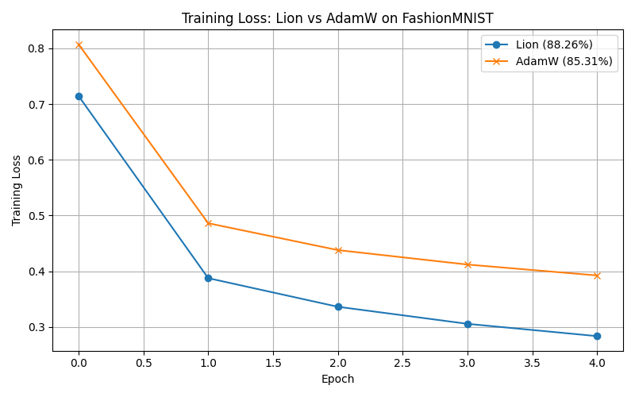

# Symbolic Optimizer Reimplementation (Lion)

This project reimplements the Lion optimizer from the NeurIPS 2023 paper:
**"Symbolic Discovery of Optimization Algorithms"**.

## Goals

- Implement the Lion optimizer.
- Train a model on a simple task using Lion and compare with AdamW.
- (Later) Build a minimal symbolic program search simulator.
- Document the process and publish it on GitHub.

## Project Timeline

- **Day 1**: Environment setup, paper reading, GitHub repo.
- **Day 2**: Implement Lion and baseline AdamW.
- **Day 3**: Simulate symbolic program search .
- **Day 4**: Evaluate Lion, visualize, finalize repo.

## Installation

Run this to install dependencies:

```bash
pip install torch numpy matplotlib sympy
```

## 🚀 Usage

To train with both optimizers and save the plot:

```bash
python train.py
```

## Symbolic Optimizer Search

Run a simplified evolutionary search:

```bash
python run_search.py
```

## 🔍 Results

### Training Loss



- **Lion** outperforms or closely matches **AdamW** on FashionMNIST in fewer steps.
- Lion uses only the `sign()` of the update — saving memory and computation.

### Test Accuracy (after 5 epochs)

- **Lion**: 88.26%
- **AdamW**: 85.31%

> Results may vary slightly due to random initialization.
